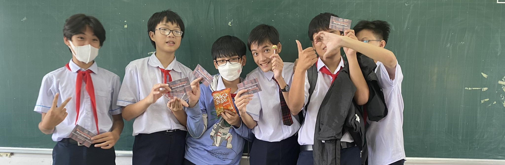

# 
 Artium 
                    
                    

<a href="https://github.com/artium-team/NTP-Haunted-House" style="color: #24292e;">The Haunted House at NTP Junior Highschool</a>

 Artium is a group of teens who love coding and are passionate about solving real-world problems with artificial intelligence. We have many projects that aim to make a positive impact on society, such as tackling world hunger, improving education, and promoting sustainability. 

## 📙 Our Philosophy
**"For teens, by teens"** is our philosophy and code, tools are not the only things we open source!

## 💼 Our projects

 Some of the projects that we are working on or have completed which you can involved in: 

- 
<a href="https://artium.epizy.com/endworldhunger/" style="color: #24292e;">🖠End World Hunger</a>

 A website for you to join us in the fight to end world hunger. Learn about the causes and effects of hunger, and find out how you can help! 🔠

- 
<a href="https://github.com/artium-team/workshop" style="color: #24292e;">🔨 Workshop</a>

 Learn programming together by creating coding tutorials in our workshop! 🔨  

- 
<a href="https://github.com/artium-team/tim-bot" style="color: #24292e;">👽 Tim Bot</a>

 A teen friend named Tim, who live in Europa, one of Jupiter's moon! 🤖  

- 
<a href="https://github.com/artium-team/axolotl" style="color: #24292e;">🦕 Axolotl</a>

 Draw an axolotl, our mascot and submit a PR! 🦖 

- 
<a href="https://github.com/artium-team/Argoo" style="color: #24292e;">🧩 Argoo</a>

 A web for class quizzes game but without phones! 🧩 

- 
<a href="https://artium.epizy.com/colorful/" style="color: #24292e;">🖌️ Colorful</a>

 A web that you can draw together like r/place! ✏️ 

- 
<a href="https://github.com/artium-team/brainfuck-interpreter" style="color: #24292e;">🤯 Brainfuck Interpreter</a>

 A simple Brainfuck interpreter written in C 🧠 

 

 Together, we can code for a better world. 

